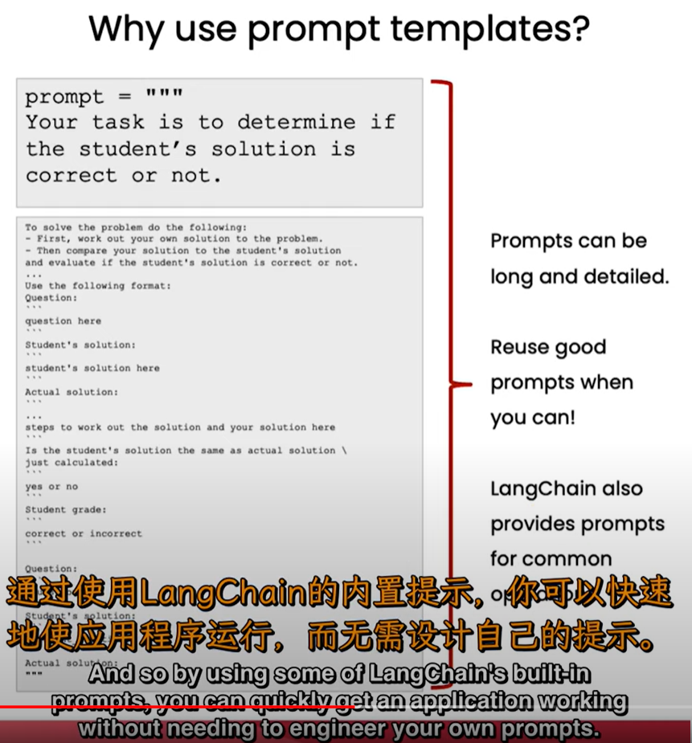

# 模型，提示和输出解析

## Chat API : LangChain

### 流程

- 定义chat机器人

  ~~~python
  from langchain.chat_models import ChatOpenAI
  chat = ChatOpenAI(temperature=0)# temperature是随机性参数，越接近1就越随机
  # 这里面默认是0，7
  ~~~

- 定义语言模板

  ~~~python
  from langChain.prompts import ChatPromptTemplate
  template_string="""翻译一段话，风格是{style},这段话是'''{text}'''"""
  prompt_template=ChatPromptTemplate.from_template(template_string)
  ~~~

- 用模板生成消息

  ~~~python
  style="""中文，幽默风趣"""
  text="""i m a man"""
  message = prompt_template.format_messages(style=style,text=text)
  ~~~

- 将消息发送给chat机器人

  ~~~python
  response=chat(message)
  print(response)# 生成回答
  ~~~

### 为什么用prompt templates?替代掉f字符串提示符？



而且支持很多文件格式的输入，比如mysql数据库，就省了很多事

## Output Parsers

可以将文本转化为某种特性的格式，但是这个格式是字符串出来的

~~~python
customer_review = """\
This leaf blower is pretty amazing.  It has four settings:\
candle blower, gentle breeze, windy city, and tornado. \
It arrived in two days, just in time for my wife's \
anniversary present. \
I think my wife liked it so much she was speechless. \
So far I've been the only one using it, and I've been \
using it every other morning to clear the leaves on our lawn. \
It's slightly more expensive than the other leaf blowers \
out there, but I think it's worth it for the extra features.
"""

review_template = """\
For the following text, extract the following information:

gift: Was the item purchased as a gift for someone else? \
Answer True if yes, False if not or unknown.

delivery_days: How many days did it take for the product \
to arrive? If this information is not found, output -1.

price_value: Extract any sentences about the value or price,\
and output them as a comma separated Python list.

Format the output as JSON with the following keys:
gift
delivery_days
price_value

text: {text}
"""

from langchain.prompts import ChatPromptTemplate

prompt_template = ChatPromptTemplate.from_template(review_template)
print(prompt_template)


messages = prompt_template.format_messages(text=customer_review)
chat = ChatOpenAI(temperature=0.0)
response = chat(messages)
print(response.content)

type(response.content)# str

# You will get an error by running this line of code 
# because'gift' is not a dictionary
# 'gift' is a string
# 这段会报错，因为输出的单纯知识字符串
response.content.get('gift')


~~~

~~~shell
AttributeError                            Traceback (most recent call last)
Cell In[34], line 4
      1 # You will get an error by running this line of code 
      2 # because'gift' is not a dictionary
      3 # 'gift' is a string
----> 4 response.content.get('gift')

AttributeError: 'str' object has no attribute 'get'
~~~

## 解析器output_parsers

> 能够生成提示词，能够将字符串解析成各种数据结构

~~~python
from langchain.output_parsers import ResponseSchema
from langchain.output_parsers import StructuredOutputParser
~~~

`ResponseSchema`是一种描述变量的工具，对象是name和description的结合,也就是字典的元素

`StructuredOutputParser`是将`ResponseSchema`转变成解析器的工具，解析成json（字典）

- 将变量进行描述，生成解析器

~~~python
gift_schema = ResponseSchema(name="gift",
                             description="Was the item purchased\
                             as a gift for someone else? \
                             Answer True if yes,\
                             False if not or unknown.")
delivery_days_schema = ResponseSchema(name="delivery_days",
                                      description="How many days\
                                      did it take for the product\
                                      to arrive? If this \
                                      information is not found,\
                                      output -1.")
price_value_schema = ResponseSchema(name="price_value",
                                    description="Extract any\
                                    sentences about the value or \
                                    price, and output them as a \
                                    comma separated Python list.")

response_schemas = [gift_schema, 
                    delivery_days_schema,
                    price_value_schema]
~~~

~~~python
output_parser = StructuredOutputParser.from_response_schemas(response_schemas)
~~~

- 通过解析器生成描述词

  ~~~python
  format_instructions = output_parser.get_format_instructions()
  ~~~

  ~~~python
  The output should be a markdown code snippet formatted in the following schema, including the leading and trailing "\`\`\`json" and "\`\`\`":
  
  ```json
  {
  	"gift": string  // Was the item purchased                             as a gift for someone else?                              Answer True if yes,                             False if not or unknown.
  	"delivery_days": string  // How many days                                      did it take for the product                                      to arrive? If this                                       information is not found,                                      output -1.
  	"price_value": string  // Extract any                                    sentences about the value or                                     price, and output them as a                                     comma separated Python list.
  }
  ```
  ~~~

  

- 运用描述词（也就是说，chat只能输入字符串，输出字符串）

  ~~~python
  review_template_2 = """\
  For the following text, extract the following information:
  
  gift: Was the item purchased as a gift for someone else? \
  Answer True if yes, False if not or unknown.
  
  delivery_days: How many days did it take for the product\
  to arrive? If this information is not found, output -1.
  
  price_value: Extract any sentences about the value or price,\
  and output them as a comma separated Python list.
  
  text: {text}
  
  {format_instructions}
  """
  
  prompt = ChatPromptTemplate.from_template(template=review_template_2)
  
  messages = prompt.format_messages(text=customer_review, 
                                  format_instructions=format_instructions)
                                  
                                  
  response = chat(messages)# response是字符串
  ~~~

- 将字符串解析成特定的数据结构

  ~~~python
  output_dict = output_parser.parse(response.content)
  type(output_dict)  #dict
  output_dict.get('delivery_days') #'2'
  ~~~

  