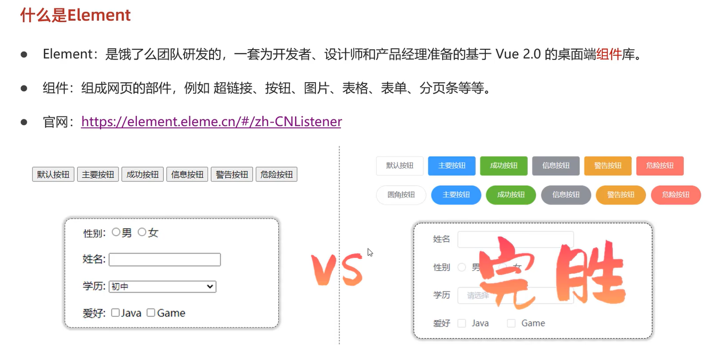
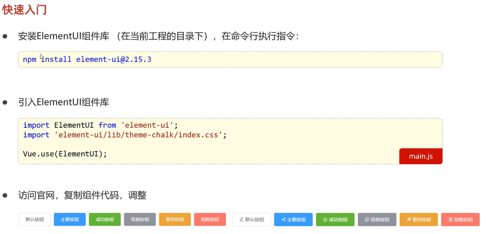
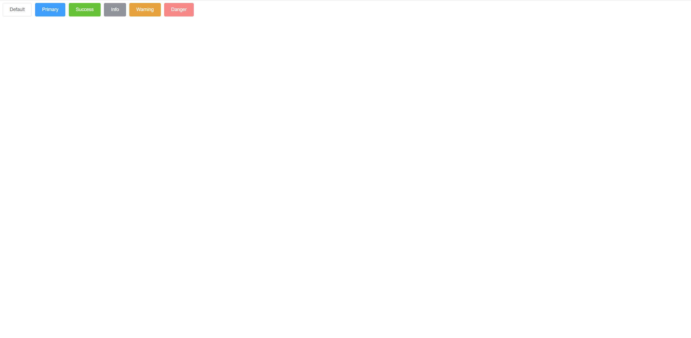
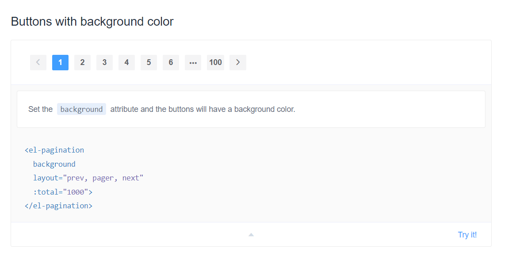
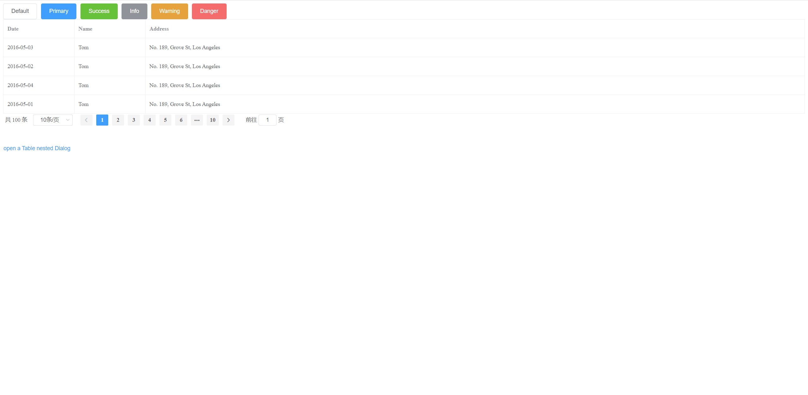
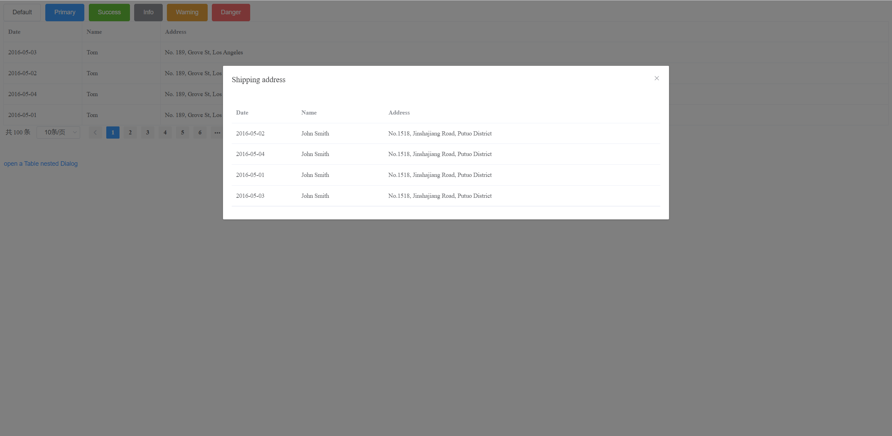

# [Vue组件库Element](https://element.eleme.cn/#/en-US)

> 安装库的时候，需要在管理员身份运行的cmd下进行操作--针对于windows

## 使用：

- 创建elements文件夹，在文件夹下面创建`ElementView.vue` ,文件内容是

  ~~~vue
  //vue组件文件有三个部分组成,el-row段代码是复制的
  <template>
    

      <el-row>
        <el-button>Default</el-button>
        <el-button type="primary">Primary</el-button>
        <el-button type="success">Success</el-button>
        <el-button type="info">Info</el-button>
        <el-button type="warning">Warning</el-button>
        <el-button type="danger">Danger</el-button>
      </el-row>
    

  </template>
  
  
  
  
  ~~~

- APP.vue的改写

  ~~~vue
  <template>
    

      <!-- 
      <HelloWorld msg="Welcome to Your Vue.js App"/> -->
      <element-view></element-view>
    

  </template>
  
  
  
  
  
  ~~~

- main.js的引用库

  ~~~js
  import Vue from 'vue'
  import App from './App.vue'
  import ElementUI from 'element-ui'
  import 'element-ui/lib/theme-chalk/index.css'
  Vue.config.productionTip = false
  Vue.use(ElementUI)
  new Vue({
    render: h => h(App),
  }).$mount('#app')
  
  ~~~

## 效果：

# Element-Table

> 基本就是cv

加了表格之后的代码：

~~~vue
//vue组件文件有三个部分组成
<template>
  

    <el-row>
      <el-button>Default</el-button>
      <el-button type="primary">Primary</el-button>
      <el-button type="success">Success</el-button>
      <el-button type="info">Info</el-button>
      <el-button type="warning">Warning</el-button>
      <el-button type="danger">Danger</el-button>
    </el-row>

    <!-- table -->
    <el-table :data="tableData" border style="width: 100%">
      <el-table-column prop="date" label="Date" width="180"> </el-table-column>
      <el-table-column prop="name" label="Name" width="180"> </el-table-column>
      <el-table-column prop="address" label="Address"> </el-table-column>
    </el-table>
  

</template>

~~~

# Element-Pagination

- 复制粘贴代码（随便选的）

  

  ~~~vue
  <el-pagination
    background
    layout="prev, pager, next"
    :total="1000">
  </el-pagination>
  ~~~

- 修改代码自定义属性和事件

  ~~~vue
  <!-- pagination -->
      <el-pagination
        background
        layout="total,sizes,prev, pager, next,jumper"
        @size-change="handlesizechange"
        @current-change="handlecurrentchange"
        :total="100"
      >
      </el-pagination>
  ~~~

- 事件函数

  ~~~js
   methods: {
      handlecurrentchange: function (current_page) {
        alert(current_page);
      },
      handlesizechange: function (page_size) {
        alert(page_size);
      },
    },
  ~~~

  - 要写在`methods`方法里

- 为什么`total`前面加`:`?

    > 在Vue.js中，冒号（:）是用于绑定数据的一种简写语法，也称为v-bind指令。它允许你将Vue实例中的数据属性与组件的属性进行绑定。
    >
    > 在你的示例中，`<el-pagination :total="100">`中的冒号表示将Vue实例中的数据属性绑定到`<el-pagination>`组件的`total`属性。通过使用冒号，你可以将Vue实例中的数据动态地传递给组件，并实现数据驱动的更新。
    >
    > 在这种情况下，`:total="100"`将Vue实例中的数据属性与`<el-pagination>`组件的`total`属性进行绑定。这意味着你可以在Vue实例中的数据对象中定义一个名为`total`的属性，并将其值设置为100。通过这种绑定，当Vue实例中的`total`属性的值发生变化时，`<el-pagination>`组件的`total`属性也会相应地更新。
    >
    > 总结起来，冒号语法（:）用于将Vue实例中的数据属性与组件的属性进行绑定，以实现数据的动态传递和更新。这样可以让你方便地在Vue中操作和控制组件的行为。

- 完整代码

  ~~~vue
  //vue组件文件有三个部分组成
  <template>
    

      <el-row>
        <el-button>Default</el-button>
        <el-button type="primary">Primary</el-button>
        <el-button type="success">Success</el-button>
        <el-button type="info">Info</el-button>
        <el-button type="warning">Warning</el-button>
        <el-button type="danger">Danger</el-button>
      </el-row>
  
      <!-- table -->
      <el-table :data="tableData" border style="width: 100%">
        <el-table-column prop="date" label="Date" width="180"> </el-table-column>
        <el-table-column prop="name" label="Name" width="180"> </el-table-column>
        <el-table-column prop="address" label="Address"> </el-table-column>
      </el-table>
  
      <!-- pagination -->
      <el-pagination
        background
        layout="total,sizes,prev, pager, next,jumper"
        @size-change="handlesizechange"
        @current-change="handlecurrentchange"
        :total="100"
      >
      </el-pagination>
    

  </template>
  
  
  
  
  ~~~

- 效果

  

# Element-Dialog

直接上代码

~~~vue
<!-- Table -->
    <el-button type="text" @click="dialogTableVisible = true"
      >open a Table nested Dialog</el-button
    >

    <el-dialog title="Shipping address" :visible.sync="dialogTableVisible">
      <el-table :data="gridData">
        <el-table-column
          property="date"
          label="Date"
          width="150"
        ></el-table-column>
        <el-table-column
          property="name"
          label="Name"
          width="200"
        ></el-table-column>
        <el-table-column property="address" label="Address"></el-table-column>
      </el-table>
    </el-dialog>
~~~

> 这是外表

~~~js
 gridData: [{
          date: '2016-05-02',
          name: 'John Smith',
          address: 'No.1518,  Jinshajiang Road, Putuo District'
        }, {
          date: '2016-05-04',
          name: 'John Smith',
          address: 'No.1518,  Jinshajiang Road, Putuo District'
        }, {
          date: '2016-05-01',
          name: 'John Smith',
          address: 'No.1518,  Jinshajiang Road, Putuo District'
        }, {
          date: '2016-05-03',
          name: 'John Smith',
          address: 'No.1518,  Jinshajiang Road, Putuo District'
        }],
        dialogTableVisible: false,
~~~

> 数据，其中`dialogTableVisible`默认为`false`

效果：

