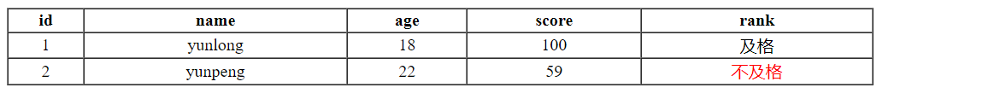

# [Vue](https://v2.cn.vuejs.org/)

## mvvm

- 双向数据绑定

## 文件结构

~~~html
<!DOCTYPE html>
<html lang='en'>
    <head>
        <meta charset="UTF-8">
        <title>Vue Learning</title>
        
        <!-- 1.绑定文件 -->
    </head>
    <body>
        <!-- 绑定message对象 -->
        <!-- v-model是指令，v开头的都是 -->
        

            <input type='text' v-model="message">
            {{message}}
        

    </body>
    
</html>
~~~

- 效果

  

## Vue常用指令

~~~html
<!DOCTYPE html>
<html lang='en'>
    <head>
        <meta charset="UTF-8">
        <title>Vue Learning</title>
        
        <!-- 1.绑定文件 -->
    </head>
    <body>
        <!-- 绑定message对象 -->
        <!-- v-model是指令，v开头的都是 -->
        

            <!-- 绑定属性 -->
            <a v-bind:href="url">github</a>   
            <a :href="url">github2</a>
            <input type='text' v-model="message">
            {{message}}
        

    </body>
    
</html>
~~~

~~~html
<!DOCTYPE html>
<html lang='en'>
    <head>
        <meta charset="UTF-8">
        <title>Vue Learning</title>
        
        <!-- 绑定文件 -->
    </head>
    <body>
        

            <input type="button" value="点我一下" v-on:click = 'handle()'>
            <input type="button" value="再点一次" @click = 'handle()'>
            <!-- v-on:click 是事件，可以有别的种类 -->
            <!-- 第二个是缩写，注意冒号也要省略 -->
        

    </body>
    
</html>
~~~

~~~html
<!DOCTYPE html>
<html lang='en'>

<head>
    <meta charset="UTF-8">
    <title>Vue Learning</title>
    
    <!-- 绑定文件 -->
</head>

<body>
    

        <!-- 第一种方式 -->
        <input type='text' v-model="age">
         0 && age < 30">年轻人
        =30 && age <60">中年人
        老年人
        <!-- 第二种方式 -->
          
        <input type='text' v-model="age">
         0 && age < 30">年轻人
         30 && age < 60">中年人
        = 60">老年人

    

</body>

</html>
~~~

- 效果

- 两者的区别

~~~html
<!DOCTYPE html>
<html lang='en'>

<head>
    <meta charset="UTF-8">
    <title>Vue Learning</title>
    
    <!-- 绑定文件 -->
</head>

<body>
    

        {{name}}
         
           {{name}}:{{index}}
        <!-- 这里千万别写反了 -->
    

</body>

</html>
~~~

## 案例

### 需求

### 结果

### 代码

~~~html
<!DOCTYPE html>
<html lang='en'>

<head>
    <meta charset="UTF-8">
    <title>Vue Learning</title>
    
    <!-- 绑定文件 -->
</head>

<body>
    

        <table border="1" cellspacing="0" width="60%">
            <tr>
                <th>id</th>
                <th>name</th>
                <th>age</th>
                <th>score</th>
                <th>rank</th>
            </tr>
            <tr v-for="(user,index) in Users" align="center">
                <td>{{index+1}}</td>
                <td>{{user.name}}</td>
                <td>{{user.age}}</td>
                <td>{{user.score}}</td>
                <td v-show="user.score >60">及格</td>
                <td v-show="user.score <=60" style="color:red">不及格</td>
            </tr>
        </table>

    

</body>

</html>
~~~

## 生命周期

- 从创建到销毁的周期

- 掌握mounted就行

~~~html
<!DOCTYPE html>
<html lang='en'>

<head>
    <meta charset="UTF-8">
    <title>Vue Learning</title>
    
    <!-- 绑定文件 -->
</head>

<body>
    

        <table border="1" cellspacing="0" width="60%">
            <tr>
                <th>id</th>
                <th>name</th>
                <th>age</th>
                <th>score</th>
                <th>rank</th>
            </tr>
            <tr v-for="(user,index) in Users" align="center">
                <td>{{index+1}}</td>
                <td>{{user.name}}</td>
                <td>{{user.age}}</td>
                <td>{{user.score}}</td>
                <td v-show="user.score >60">及格</td>
                <td v-show="user.score <=60" style="color:red">不及格</td>
            </tr>
        </table>

    

</body>

</html>
~~~

### 效果

