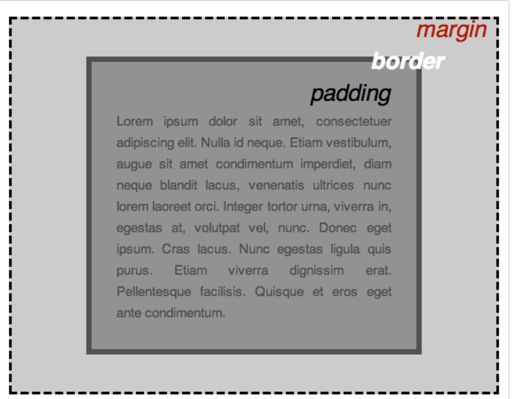

# HTML,CSS,JavaScript

> 基础

## HTML

- 不区分大小写

- 设定语言

  ~~~html
  <html lang="en-us">
  ...
  </html>
  ~~~

## CSS

### 盒子模型

### 图片居中技巧

~~~css
img {
  display: block;
  margin: 0 auto;
}
~~~

## javascript

### 等于

`===`而不是`==`

